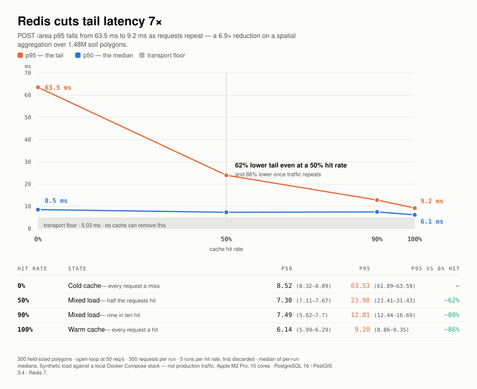

# Fieldscope

A distributed data pipeline that joins tens of millions of geographic records
across several large public datasets, precomputes the result, and serves it
from a globally cached API.

Given any field boundary, the API returns everything known about the ground
underneath it — soil composition, crop cover, and current drought conditions —
as a single low-latency lookup, rather than as an expensive geometric
computation performed per request.

> **Status: pipeline, API and public deployment all built and measured. The
> frontend is not.** The distributed join runs at state scale over California,
> and the serving tier answers over the public internet from a GCP `e2-micro`
> behind a Cloudflare Tunnel. Every figure in this README is measured from an
> actual run, with the method stated beside it. The map frontend is the one
> remaining piece of the product. No performance claim appears here until it has
> been benchmarked, and the benchmark is labelled as such — note in particular
> that the latency figures below are from a laptop and have **not** yet been
> re-measured on the deployed hardware.

---

## Live

The API is deployed on a GCP `e2-micro` behind a Cloudflare Tunnel:

```bash
curl -X POST https://<tunnel-host>/area \
  -H 'Content-Type: application/json' \
  -d '{"geometry":{"type":"Polygon","coordinates":[[[-119.852,36.648],[-119.848,36.648],[-119.848,36.652],[-119.852,36.652],[-119.852,36.648]]]}}'
```

That polygon is a 39-acre field near Fresno. It comes back with 67 land-cover
categories — grapes, almonds, citrus, pistachios, walnuts — weighted by how much
of each soil map unit the boundary covers.

**The hostname is not stable yet.** The deployment currently uses a Cloudflare
*quick tunnel*, whose URL changes every time the tunnel restarts, so it is
deliberately not written into this README. A permanent hostname needs a domain
on Cloudflare; see [docs/DESIGN.md §13](docs/DESIGN.md). Run
`sudo grep -ohE 'https://[a-z0-9-]+\.trycloudflare\.com' /var/log/cloudflared.log | head -1`
on the VM for the current one.

---

## The problem

The three source datasets describe the same land but disagree about how to
divide it up. Soil survey data is irregular polygons averaging a few acres.
Crop cover is a uniform 30-meter grid. Drought severity is a handful of
country-sized shapes. Answering "what is under this field" means reconciling
all three geometrically.

So the interesting work happens before anyone asks a question. An offline job
on Spark reconciles all three layers once — projecting them into a common
equal-area grid, resolving which soil polygon every 30-metre pixel falls in,
and collapsing 455 million records into 311,726 rows that say what grows on
each soil map unit. That output is the product. The API on top of it is
deliberately boring: find the map units a drawn polygon touches, look up rows
that already exist, add them up.

This is the core design decision, and the split is the point. The expensive
half runs on a schedule, takes as long as it takes, and is re-run when the crop
layer refreshes. The live half never recomputes any of it, so it answers in
milliseconds without needing to be clever. Most of the engineering here went
into making the precomputed layer trustworthy enough that the serving path can
afford to be that simple.

**[docs/DESIGN.md](docs/DESIGN.md)** records each decision with the constraint
that forced it, the alternatives considered, and the measured consequence —
including the ones still open.

## Architecture

```
OFFLINE (batch, scheduled)              ONLINE (container)
┌────────────────────────────┐          ┌────────────────────────────┐
│ Public datasets            │          │ React + TypeScript map     │
│  · crop cover (raster)     │          │  draw a field, see the     │
│  · soil survey (vector)    │          │  overlay                   │
│  · drought severity        │          │         │                  │
│         │                  │          │         ▼                  │
│         ▼                  │   load   │ FastAPI ─── Redis cache    │
│ Apache Spark + Sedona      │  ─────▶  │         │                  │
│  distributed join over     │          │         ▼                  │
│  10^8 records              │          │ PostgreSQL + PostGIS       │
│         │                  │          └────────────────────────────┘
│         ▼                  │
│ overlay.parquet            │           Docker Compose on one VM,
│  311,726 rows              │           behind Cloudflare
└────────────────────────────┘
```

## Scale

The pipeline is developed against a single county for fast iteration, then run
unchanged across a state. It has been run over two: Indiana first, to prove the
join at state scale, and then California, which is what the live demo serves.

| | Tippecanoe County | Indiana | **California** |
|---|---|---|---|
| Land cover records | 2,079,440 | 104,126,688 | **455,106,622** |
| Soil polygons | 30,264 | 1,482,366 | 484,325 |
| Distinct soil map units | 429 | 7,534 | 20,811 |
| **Join wall time** | **median 20.5s** | **4,103s** | **3,752s** |
| **Throughput** | **~101,000 rec/s** | **25,377 rec/s** | **121,270 rec/s** |
| Records matched to soil | 1,875,956 (90.2%) | 104,125,537 (99.999%) | 455,079,266 (99.994%) |
| Precomputed output rows | 5,349 (389:1) | 155,025 (672:1) | 311,726 (1,460:1) |

Every figure above is measured. California joined **4.4x more data than Indiana
in less wall time**, because its soil layer has a third as many polygons — soil
survey detail follows survey intensity, not area, and California's deserts and
rangeland are mapped in very large units.

California is what the demo serves, for a reason that is about the data rather
than the engineering: Indiana is corn and soybeans on uniform glacial soils and
has essentially no drought in any given week, so two of the three layers show
their full range and the third renders blank. California has the widest crop mix
in the country and a real drought signature — 68% of the state across three
severities in the week this ran. A single 39-acre query near Fresno returns 67
distinct land-cover categories.

Indiana's throughput is far below the county's, and that is a real finding
rather than a rounding of it: one grid block out of 144 took 1,986s of the
4,103s join — roughly 400x its neighbours — and the remaining 137 non-empty
blocks averaged under 10 seconds each. Grid chunking assumes blocks are
comparable work, and one block violates that badly.

The same skew reappeared on California — three blocks took 61% of the elapsed
time, the worst at 905s against a 4s median — which made it possible to test the
obvious explanations, and none of them survived. The slowest block has *fewer*
points, *fewer* polygons, *fewer* vertices and *less* oversized-polygon coverage
than a block that ran 226x faster. Spark's own metrics rule out garbage
collection (3.3% of task time), memory pressure and disk spill. The cause is
still not established, and the current suspicion is host-level memory pressure
rather than anything about the data; see [docs/DESIGN.md §5.5](docs/DESIGN.md).

Indiana's result reproduces, to the digit, percentages measured independently
from the raster before the join existed: corn at 23.69% and soybeans at 22.93%
of 23,156,980 acres.

California admits a sharper check, because its signature crops grow almost
nowhere else and their acreage is published independently:

| Crop | This pipeline | USDA, approx. |
|---|---|---|
| Almonds | 1,542,209 acres | ~1.5M |
| Grapes | 914,095 acres | ~0.9M |

Neither number was tuned. They fall out of joining a federal raster to a federal
soil survey, and land on figures published independently of both. Specialty
crops are a harder test than commodity totals: they occupy specific ground, so
matching their acreage means the geometry is right and not just the arithmetic.
Total area lands at 101.21M acres against California's ~101.5M.

Timings come from `scripts/benchmark.py` on a 10-core local Spark session:
median of 11 runs, range 14.6–54.3s. That spread is JVM warmup and page cache
state, not variation in the work — no single-run figure is quoted anywhere in
this repository.

The county's 90.2% match rate is not data loss, and it is not a property of
the ground either — it is an artifact of how that county's soil data was
downloaded. Tippecanoe's raster footprint extends past the bounding box its
soil tiles were requested for, so pixels in that margin had no polygon
available to match. Indiana, fetched across its full bounding box, matches
99.999%.

An earlier version of this README attributed the county's unmatched 9.8% to
open water and unsurveyed land. The state run disproves that: 268,118 acres of
open water appear *in* the Indiana overlay across 5,406 rows, so water pixels
do match soil polygons — SSURGO maps water as map units of its own. Two
independently computed figures agreed with each other, but both were measuring
the same download extent rather than confirming an explanation. See
[docs/DESIGN.md §9](docs/DESIGN.md).

### Correctness

`scripts/validate_join.py` recomputes the same answer by an unrelated route —
masking the raster with rasterio and counting in NumPy on a single machine —
and diffs it against the distributed result. Current status: five of six
sampled soil map units match exactly, the sixth differs by one pixel in
151,503 where a polygon edge crosses a pixel center.

### Getting there

Three defects had to be fixed before the join was usable. None of them are
things the query planner gets right on its own. Their individual contributions
have not been isolated and measured, so no per-fix speedup is claimed:

1. Spark built its spatial index over the 2.1M-row side and broadcast that —
   a single-threaded index build over the largest table in the job. Forcing
   the index onto the 30k-row polygon side streams the big side through it in
   parallel instead.
2. The land cover records arrived as four Parquet files, so Spark ran four
   tasks and used four of ten available cores.
3. The drought layer is only five rows, but they are national multipolygons
   totalling 1,332 parts and 178k vertices. Tested per-pixel they dominated
   everything else; they are now clipped to the area of interest and attached
   to soil polygons, which are orders of magnitude finer than drought regions
   anyway.

## Serving

The API answers two questions against the precomputed overlay, and neither
recomputes the join:

| Endpoint | What it does |
|---|---|
| `GET /mapunit/{mukey}` | One soil map unit's land cover breakdown — an indexed lookup. |
| `POST /area` | Takes a drawn GeoJSON polygon, finds the map units it touches through a GiST index, and aggregates their precomputed rows weighted by intersected area. |

`POST /area` returns an estimate and says so in its own response: the batch join
collapsed pixel locations into per-map-unit totals, so a field covering 30% of a
map unit reports 30% of that unit's land cover. That is exact only if land cover
is uniform within the unit, which it is not — recovering the true answer would
mean putting the raster back in the request path, which is the thing the whole
design exists to avoid.

```bash
docker compose up -d
docker compose run --rm api python scripts/load_serving.py   # ~2.3 min
curl -X POST localhost:8000/area -H 'Content-Type: application/json' \
     -d '{"geometry": {"type": "Polygon", "coordinates": [[...]]}}'
```

### Measured latency

<picture>
  <source media="(prefers-color-scheme: dark)" srcset="docs/img/hitrate-dark.svg">
  
</picture>

**This is a benchmark under synthetic load, not production traffic** — this
service has no users, and a latency figure presented as production behaviour
would be false. Method: a fixed, committed set of 300 field-sized polygons
driven open-loop at 50 req/s, 300 requests per run, five runs per hit rate with
the first discarded; every figure is the median of per-run medians, with the
observed range beside it. Measured on an Apple M2 Pro against PostgreSQL 16 /
PostGIS 3.4 and Redis 7 in Docker Compose.

| Phase | p50 | p95 | p99 |
|---|---|---|---|
| Baseline — `POST /ping`, no work done | 5.03 ms | 7.55 ms | 9.1 ms |
| Uncached — straight to PostGIS | 7.80 ms | 63.90 ms | 220.5 ms |
| Cold cache — 0% hit | 8.52 ms | 63.53 ms | 223.0 ms |
| Mixed — 50% hit | 7.30 ms | 23.98 ms | — |
| Mixed — 90% hit | 7.49 ms | 12.81 ms | — |
| Warm cache — 100% hit | 6.14 ms | 9.20 ms | 9.8 ms |

**The control row is the point.** A no-op endpoint taking the identical request
body costs 5.03 ms at p50, so most of what every other row shows is HTTP,
Pydantic validation and Docker's networking — not the query. Subtract it and
the spatial query costs about **2.8 ms** at the median against **1.1 ms** for a
cache hit. The cache saves 1.66 ms there, which is close to nothing.

**Its value is entirely in the tail, and scales with the hit rate.** p95 runs
63.9 → 24.0 → 12.8 → 9.2 ms as the hit rate goes 0 → 50 → 90 → 100%. The
100%-hit row is a ceiling rather than a result — no real workload hits on every
request — so **the number worth quoting is the 50% one: a 62% lower p95**.

**The distribution is heavy-tailed.** Uncached p99 is 220 ms and the slowest
single request observed was 616 ms, against a 7.8 ms median. A small number of
polygons touch enough map units to cost two orders of magnitude more than a
typical one. Which polygons, and why, is not yet measured.

Two checks make these trustworthy rather than merely plausible. The load
generator sustains 200 req/s at p50 3.07 ms, so at 50 req/s it is not the
constraint. And quadrupling the connection pool moved p95 by 0.3 ms, so the
tail is real query cost, not requests queueing for a connection.

Two caveats, stated rather than buried. `/ping` returns a tiny body while
`/area` returns up to ~20 breakdown entries, so the floor excludes response
serialization and is a *lower bound* on overhead — which makes the "caching
barely helps the median" finding stronger, not weaker. And the mixed rows split
warm from cold by index, so which polygons land in the miss set is arbitrary;
their p95 is stable across runs but their p99 is not reported, because at a 90%
hit rate only 30 distinct polygons are ever missed.

These are laptop numbers. The deploy target is a shared-vCPU e2-micro with ~1 GB
of RAM, which is a different machine entirely; the figures that belong next to a
deployed link are the ones measured on the box that serves it.

Reproduce with:

```bash
.venv/bin/python scripts/benchmark_serving.py --phase warm --rate 50 --requests 300
```

## Data sources

All public, federal, and actively maintained. No synthetic data anywhere in
the pipeline.

| Dataset | Source | What it provides |
|---|---|---|
| Cropland Data Layer | USDA NASS | 30m crop classification, annual |
| SSURGO | USDA NRCS | Field-verified soil survey polygons |
| Drought Monitor | NDMC / NOAA / USDA | Weekly drought severity, D0–D4 |
| County boundaries | US Census | Area-of-interest definition |

Each is fetched by a script in `scripts/`, so the full input set is
reproducible from a clean checkout. Access quirks that cost real debugging
time are documented in comments at the top of each script.

## Repository layout

```
scripts/     one script per dataset, plus the join, validation and benchmark
src/         pipeline package; config.py defines the areas of interest
data/        gitignored — everything here is re-downloadable
docs/        DESIGN.md — problem statement and decision record
```

## Running it

Requires Java 17 and Python 3.11. Both are pinned deliberately: Spark 3.5 and
Sedona 1.7 are not tested against newer runtimes and fail in unhelpful ways —
a newer JDK or Python will not merely warn, it will fail obscurely.

On macOS, `brew install openjdk@17`; the session builder looks for it at
`/opt/homebrew/opt/openjdk@17` and sets `JAVA_HOME` itself, so no shell
configuration is needed. Sedona's JVM artifacts resolve from Maven on first
run and cache in `~/.ivy2` (~121 MB, one time), which is why the first Spark
start after a clean checkout is slow.

```bash
uv sync

.venv/bin/python scripts/download_boundaries.py
.venv/bin/python scripts/download_cdl.py
.venv/bin/python scripts/download_ssurgo.py
.venv/bin/python scripts/download_drought.py

.venv/bin/python scripts/explore.py     # sanity report over the downloaded data

# the join
.venv/bin/python -u scripts/rasterize_cdl.py           # raster -> 2.08M Parquet rows
.venv/bin/python -u scripts/run_join.py --limit 100000 # sample first, ~14s
.venv/bin/python -u scripts/run_join.py                # full run
.venv/bin/python -u scripts/validate_join.py           # diff against single-machine truth
.venv/bin/python -u scripts/benchmark.py --runs 7      # median + range, not one run
```

Every script takes `--aoi {tippecanoe,indiana}` to override the configured
area for that run alone. The join additionally takes:

```bash
--chunks N    # split into an N x N grid, one broadcast join per block
--cores N     # cap Spark's cores so a long run leaves the machine usable
--strategy    # broadcast | partitioned | auto (auto picks from polygon count)
--limit N     # random sample of N land cover records
```

Statewide, which needs the chunked path. `--strategy broadcast` is required,
not optional — without it the polygon count trips automatic strategy selection,
which disables the per-block broadcast that chunking depends on. See
[docs/DESIGN.md §9](docs/DESIGN.md):

```bash
.venv/bin/python -u scripts/run_join.py --aoi indiana --strategy broadcast \
  --chunks 12 --cores 6
```

`data/` is gitignored; everything in it rebuilds from the scripts above. The
whole pipeline was reproduced from a clean machine after a hardware reimage,
and every correctness figure — down to a known single-pixel edge artifact —
came back identical.

`DEFAULT_AOI` in `src/fieldscope/config.py` sets the area every script uses by
default; `--aoi` overrides it per run. Statewide needs `--chunks`, because
broadcasting 1.34M soil polygons exhausts the driver — the limit was measured
at between 300,000 and 600,000 polygons, and the alternatives are compared in
[docs/DESIGN.md §5.5](docs/DESIGN.md).

### Watching a long run

Three things that cost real debugging time, recorded so they cost it once:

- Use `python -u`, and don't pipe a running job through `grep` or `head`.
  Python block-buffers to a pipe and those tools buffer again; together they
  mean a live job emits an empty log and you debug blind.
- macOS has no `timeout`. Put a watchdog on anything long:
  `( sleep 480 && pkill -f 'fieldscope-join' ) & WD=$!` — then `kill $WD`
  once it finishes.
- Sample with `--limit`, which samples *randomly*. Records are written in
  raster scan order, so a plain `LIMIT` returns a thin strip of the top edge.
  That understated the match rate as 31% and made throughput meaningless.

## Progress

- [x] Data acquisition — all four sources scripted and verified
- [x] Exploration and cross-layer validation
- [x] Spark + Sedona distributed join, validated against single-machine truth
- [x] A join strategy that survives state scale, verified on county data
- [x] The Indiana run — 104,125,537 records joined, 155,025 rows out
- [x] The California run — 455,079,266 records joined, 311,726 rows out, and a
      drought layer with three severities across 68% of the state
- [x] Serving store — PostgreSQL + PostGIS, loaded and indexed
- [x] API — `GET /mapunit/{mukey}` and `POST /area` over the precomputed overlay
- [x] Redis read-through cache, keyed by the normalised polygon
- [x] Latency benchmarking under stated synthetic load — *on a laptop*
- [x] Deploy — GCP e2-micro behind a Cloudflare Tunnel, answering publicly
- [ ] **Map frontend** — the one remaining piece of the product
- [ ] Re-measure the benchmark on the deployed hardware
- [ ] A stable hostname (the quick tunnel's URL changes on restart)
- [ ] Indiana served alongside California
- [x] ~~Scheduled weekly refresh of the drought layer~~ — descoped; the layer is
      a labelled snapshot of one USDM week
